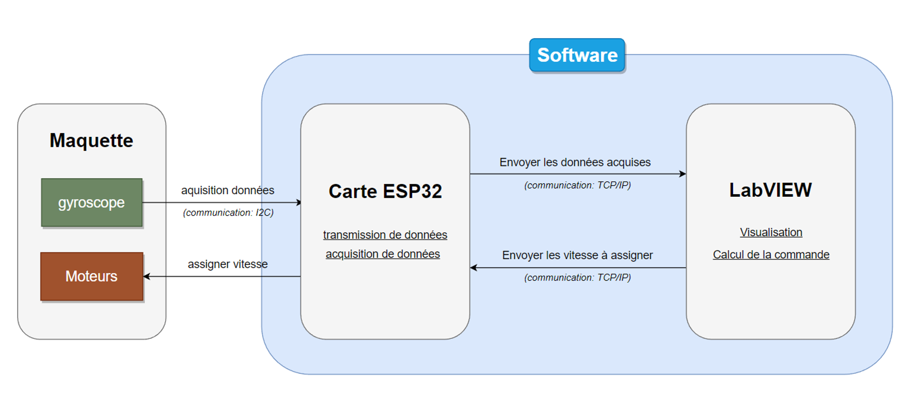

# 1 DOF VTOL Benchmark

This project is a Computer Aided Design (CAD) project where we designed and controlled a one degree-of-freedom (1 DOF) Vertical Take-Off and Landing (VTOL) benchmark. We made the mechanical design using Solidworks and we built the physical model using cardboard and designed a circuit on Proteus ISIS that connects two mini motors and a gyroscope to an ESP32 microcontroller. The ESP32 acts as a Wi-Fi server and sends the acquired data over TCP to LabVIEW, where the received data is visualized, PID is calculated, and the motors are controlled. We have a manual mode without the use of PID, and we manually tuned the PID coefficients to achieve a good step response.

https://github.com/Moemen-02/1-dof-vtol-benchmark/assets/89520188/708dc6f2-c66b-4c4e-8198-d8db4de3df6e

## Table of Contents

- [Overview](#Overview)
- [Getting Started](#getting-started)
- [Usage](#usage)
- [Contributing](#contributing)
- [Contact Us](#contact-us)
- [License](#license)

## Overview

Note: The detailed diagrams can be found in the `diagrams/` directory.

## Getting Started

### Prerequisites

To build and run this project, you will need the following:

- Solidworks for CAD design
- Proteus ISIS for circuit design
- ESP32 microcontroller
- LabVIEW for data visualization and control

### Installation

To install and run the project, follow these steps:

1. Clone this repository to your local machine
2. Open the ESP32 code in PlatformIO IDE, replace the `ssid` and `password` with your ssid and password then upload the code to your ESP32 and make sure that it connects the the WiFi, that the gyro is recognized and the motors are working (Motor 1 should spin then Motor 2 for a bit when the code starts running if everything is in order).
3. Open the LabVIEW VI and replace the IP Adress with your ESP32 IP adress (It's possible to make the IP adress static using the `STATIC_IP` flag) then run the VI.
4. If everything is setup correctly, The data should start streaming to the LabVIEW VI, where it can be visualized and controlled
5. (Optional) Reset the ESP32 when you need to calibrate the gyro.

## Usage

### Structure of the repository

This repository contains the following files and directories:

- `ESP32_code/`: Contains the code for the ESP32 microcontroller
- `LabVIEW_VI/`: Contains the LabVIEW VI used for data visualization and control
- `video/`: Contains the video of the benchmark showing the step response

<!-- Note: The diagrams of the Solidworks model, Proteus ISIS diagram, and communication diagram will be added to the README later. -->

### Running the project

To run the project, follow the steps in the Installation section. Once the ESP32 and LabVIEW VI are running and connected, you can use the LabVIEW VI to visualize the data and control the system.

## Contributing

We welcome contributions from everyone! Please see our `CONTRIBUTING.md` file for details (will be updated soon).

## Contact Us

If you have any questions or need help figuring out something, you can contact us anytime:

- Moemen Ben Hamad: [LinkedIn](https://www.linkedin.com/in/moemen-benhamad/) | moemen.benhamad@insat.ucar.tn
- Bilel Bekalti: [LinkedIn](https://www.linkedin.com/in/bilel-bekalti-742459169/) | bilel.bekalti@insat.ucar.tn
- Khalil El Amine: [LinkedIn](https://www.linkedin.com/in/khalil-el-amine/) | khalil.elamine@insat.ucar.tn
- Fendi Yassine: [LinkedIn](https://www.linkedin.com/in/yassine-fendi-25141a241/) | yassine.fendi@insat.ucar.tn

## License

This project is licensed under the MIT License - see the `LICENSE.md` file for details.
